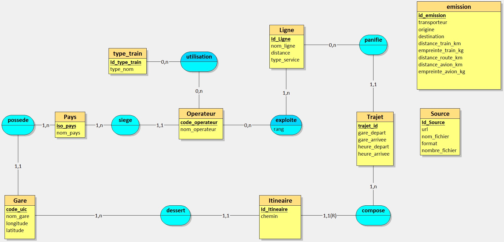

# MSPR – ObRail Europe  
## Industrialisation d’une solution IA appliquée aux flux ferroviaires européens

---

## Contexte du projet

Ce projet s’inscrit dans le cadre de la MSPR (Bloc E6.3 – Produire et maintenir une solution I.A).

ObRail Europe est un observatoire spécialisé dans l’analyse des flux ferroviaires européens et la promotion de la mobilité durable.  
L’objectif est de mettre en production une solution applicative complète permettant :

- L’intégration et l’harmonisation de données ferroviaires européennes
- L’exposition de ces données via une API REST
- La mise en place d’une architecture industrialisée (Docker, CI/CD, Monitoring)
- La préparation à l’intégration future d’un modèle d’intelligence artificielle

---

## Objectifs techniques

Le projet vise à :

- Définir les sources et les outils nécessaires à la collecte des données
- Mettre en place un processus ETL automatisé et sécurisé
- Garantir la qualité, la cohérence et l’harmonisation des données
- Concevoir une base de données relationnelle robuste
- Développer une API REST industrialisée
- Préparer l’infrastructure à une intégration IA future

---

## Pipeline global du projet

1. Identification et intégration des sources de données (CSV, GTFS, API)
2. Automatisation du processus ETL
3. Nettoyage, normalisation et contrôle qualité des données
4. Modélisation UML et conception du schéma relationnel
5. Implémentation de la base PostgreSQL
6. Développement de l’API REST (FastAPI)
7. Mise en place des tests automatisés
8. Conteneurisation (Docker)
9. Intégration CI/CD
10. Supervision et monitoring

---

## Modélisation des données

La base de données est structurée en trois couches :

### 🔹 Référentiel
- Pays
- Gare
- Opérateur
- Ligne
- Type de train
- Source (traçabilité ETL)

### 🔹 Exploitation
- Trajet (circulation réelle)
- Passage (étapes éventuelles)

### 🔹 Analyse
- Emission (comparaison environnementale train vs avion)

---

## Modèle Conceptuel de Données (MCD)

Le MCD a été conçu afin de garantir :

- Une séparation claire entre structure réseau et circulation réelle
- Une compatibilité avec des flux multi-sources
- Une évolutivité vers des analyses avancées et modèles IA

---

## Stack technique

### Backend
- Python
- FastAPI
- SQLAlchemy
- PostgreSQL

### Data
- ETL automatisé (Talend)
- Normalisation et validation

### DevOps
- Docker / Docker Compose
- GitHub Actions (CI/CD)
- Monitoring

---
## Perspectives

Cette première phase industrialise le socle technique.  
La phase suivante intégrera :

- Des modèles d’intelligence artificielle
- Des analyses prédictives (retards, émissions)
- Des tableaux de bord avancés

---

## Équipe projet

Projet réalisé dans le cadre de la certification professionnelle  
membres de l’equipe : Kouamé Johan BILÉ, Joseph HACCANDY, Glody KUTUMBAKANA, Nabil DIA

**Développeur en Intelligence Artificielle & Data Science – RNCP36581**